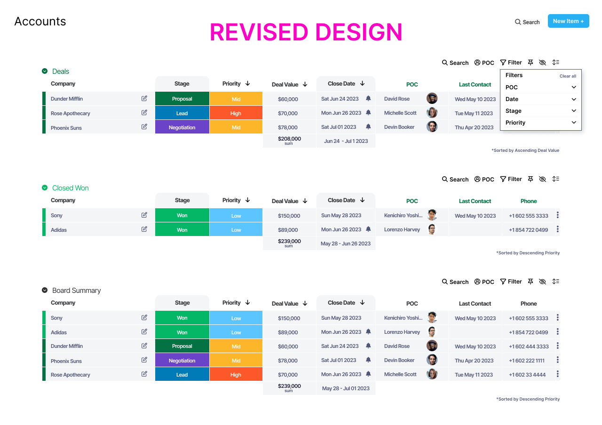

# proj1-dashboard

(_front-end-fundamentals_)

This project is focused on building a simple, clean scalable and maintainable website using HTML semantics, BEM for CSS organization, Sass for CSS preprocessor, vanilla javascript for local API fetch and navbar responsiveness and Gulp for automated front-end build task such as minifying SCSS, JS and images.

### UI Design

The revised design showcased below is an enhanced rendition of the task I worked on during my previous front-end interview. The challenge presented was to create the design without relying on any frameworks. I implemented slight modifications, such as the removal of unnecessary icons and overall simplification, resulting in an improved version.

[Figma Design](https://www.figma.com/proto/cAv6BuAe7SW9SskPRLGgy6/Dashboard-revised-proj1?type=design&node-id=60-791&scaling=contain&page-id=0%3A1)



### Functionality

**HTML**

1. Semantic markup for accessibility

**CSS**

1. Set up Sass partials to organize
2. BEM for clean, understandable and maintanable code
3. User interface design translated into web page
4. Set up media queries for responsiveness and device compatability

**Javascript**

1. API Call to local json file by using the following functions.
   - Used **fetch** for getting data and **catch** for error handling responses
   - Conversion of property values to currency and date
   - Iterate multiple arrays to each table
   - Getting the sum of total values for **Deal Value** in each table
2. Clickable mobile navbar, expected to toggle and show menu.

### Dependencies

1. **generator-website-starter** that I created. Here's the [npm pacakge](https://www.npmjs.com/package/generator-website-starter)

### Deplying in Netlify

npm package doesn't have the **gulp build** so I added this line of code in the **gulpfile.js**

```
exports.build = series(parallel(scssTask, jsTask, optimizeImg));
```

### Credits

- [The Table element](https://developer.mozilla.org/en-US/docs/Web/HTML/Element/table#browser_compatibility)

- [fetch api](https://www.youtube.com/watch?v=eS-FVnhjvEQ)

- [how to deploy gulp build in netlify](https://www.youtube.com/watch?v=KQp3VKSYQ_U)

- [toggle classList](https://www.w3schools.com/howto/tryit.asp?filename=tryhow_js_toggle_class)
